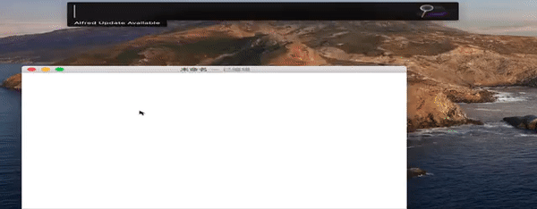
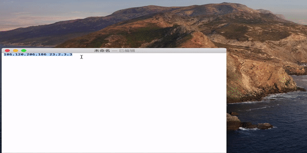

# show your ip

###安装过程
1. 下载 [showYourIP](./IP.alfredworkflow)
2. 双击文件,直接导入alfred4中(未兼容Alfred3,只支持Alfred4)

 

###使用过程
1. 在alfred框中直接输入,**显示本机局域网ip和外部ip**.按下*enter*后,复制ip到剪切板  
例子:  ip  
  
2. ip 想要查询的ip,支持多ip和正则提取  
例子1(单ip):  ip 12.2.2.3  
例子2(多ip): ip 12.2.2.3 4.232.2.3  
  
例子3(正则提取): ip 123.23.90.32:8080  

 

